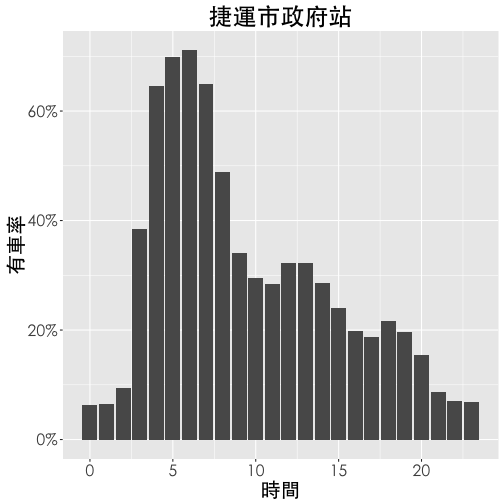
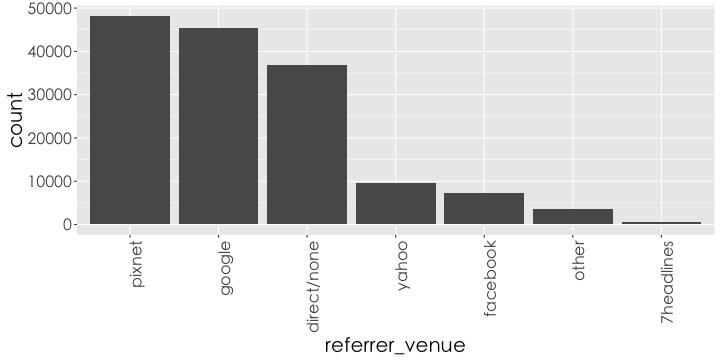
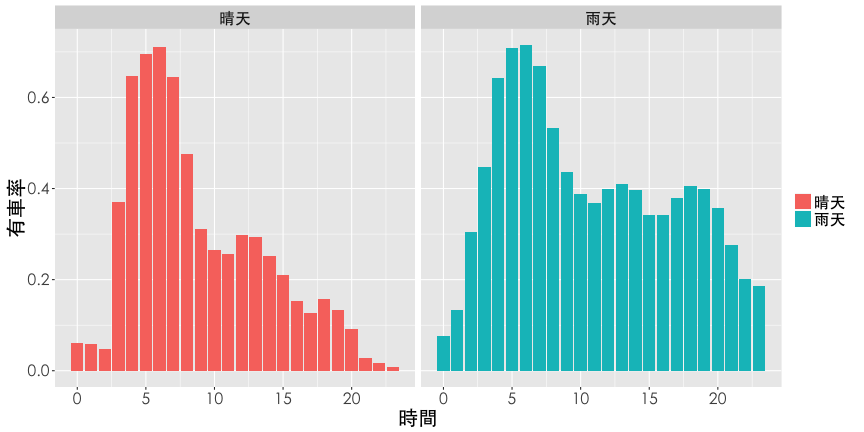
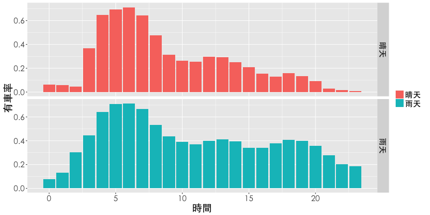
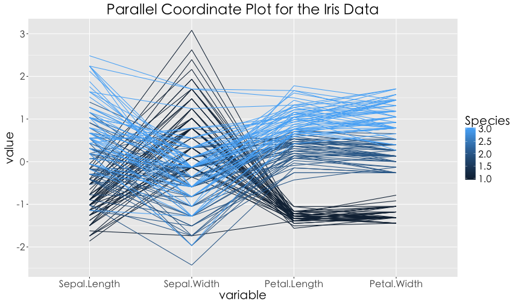
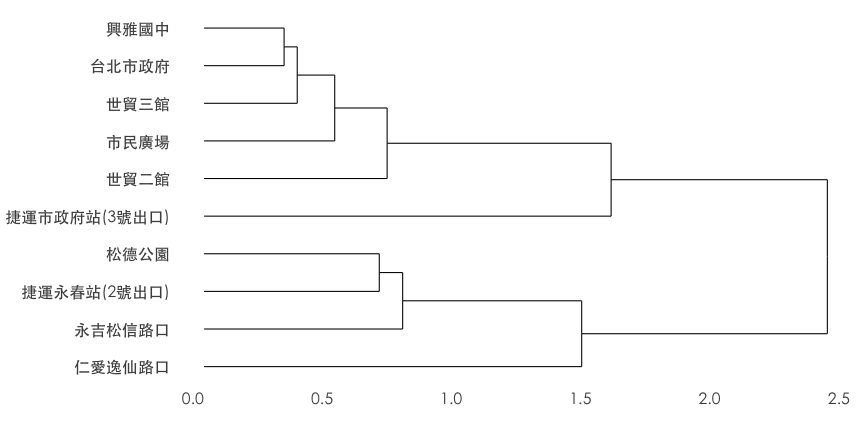
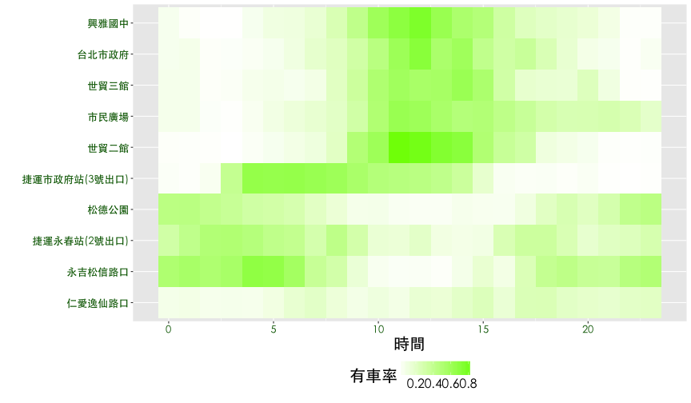
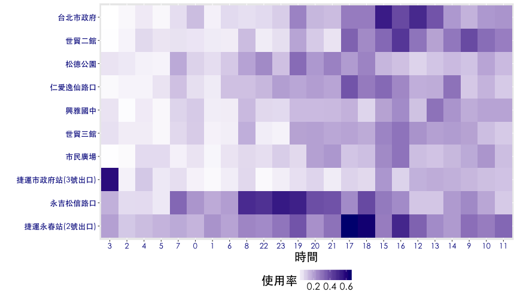

## 一切先從讀檔開始


```r
ubike <- fread("data/ubikebyhourutf8/ubike-hour-201502-utf8.csv", 
               data.table = FALSE,
              colClasses=c("factor","integer","integer","factor","factor","numeric",
                "numeric","integer","numeric","integer","integer","numeric",
                "numeric","integer","integer","numeric","numeric","numeric",
                "numeric","numeric","numeric"))
```


--- .dark .segue

## 訂定主題


---  .largecontent 

## 探索性資料分析 — 以YouBike為例
- 專案主題：捷運市府站Youbike租借分析
- 小組成員：Johnson (DSP C.K.O.)
- 角色扮演：YouBike業者御用資料科學家
- 研究目的：捷運市府站為規模最大的YouBike場站 (共**180**個停車格)，尖峰時段期間車輛的平均出借變化量達**27**輛，透過該場站與週邊場站租借狀況以及天氣資料的交叉比對，找出使用者行為以提供進一步加值服務的規劃。

---  .largecontent
## 規劃流程：
- 訂定主題
- 資料探索
    + 市府站 vs. 天氣
    + 市府站 vs. 週邊場站
    + 探索關鍵因子
- 看圖說故事
- 決策建議

--- 
## 整理一下資料


```r
ubike1 <- filter(ubike, sno==1) %>%
  mutate(sbi.range=max.sbi-min.sbi) %>%
  mutate(is.rushhours=cut(hour, breaks=c(0, 8, 10, 17, 20, 24), 
                          labels = c(0,1,0,1,0), right=FALSE)) %>%
  mutate(is.weekday=ifelse(strftime(date, "%u") < 6, 1, 0))

tab1 <- filter(ubike1, is.rushhours==1, is.weekday==1) %>% 
  group_by(tot) %>%
  summarise(min(sbi.range), mean(sbi.range), max(sbi.range))
```

---
## 市府站車輛數基本數據


```r
# 有車率
df1 <- group_by(ubike1, date, hour) %>%
  summarise(rate.sbi=mean(avg.sbi)/tot) %>%
  group_by(hour) %>%
  summarise(rate.sbi=mean(rate.sbi))

# 設定畫圖的字體
thm <- function() theme(text=element_text(size=20, family="STHeiti"))
# thm <- function() theme(text=element_text(size=20)) # Windows user

library(scales)
ggplot(df1, aes(x=hour, y=rate.sbi)) +
  geom_bar(stat="identity") + 
  ggtitle("捷運市政府站") +
  labs(x="時間", y="有車率") +
  thm() +
  theme(legend.title=element_blank()) + 
  scale_y_continuous(labels = percent)
```

--- &twocol .largecontent
## 市府站車輛數基本數據

*** =left

 

*** =right
右圖為捷運市府站每天有車率的變化，大約晚間十點至隔天凌晨兩點間有車率 (當時段平均車輛數 / 總車輛數) 最低，係因此時YouBike公司將車輛回收，於清晨三點左右陸續將車輛補回。由圖可知三點與四點時有車率大幅增加兩次，推測是市府站規模較大需要兩次小貨車補給 (每次約補給30輛車)。在上午七點左右，有車率開始明顯下降，直至上午十點到達低點，即**29%**。之後有車率略微增加，直至下午一點達到當日次高峰。可以發現，下午三點之後有車率再度明顯下降，直至晚間九點。<br><p>

---
## 場站有車率與晴雨關係
- 定義：有車率 (`rate.sbi`) 為 平均車輛數 / 總停車格數 (`avg.sbi/tot`)
- 定義：是否下雨 (`is.rain`)，當該時段累積雨量大於1mm訂為雨天，反之為晴天
依 日期 (`date`)、時間 (`hour`)、是否下雨 (`is.rain`) 做分組 (`group_by`) 計算
平均有車率 (`rate.sbi = mean(avg.sbi/tot)`)，得到下表：

<table>
 <thead>
  <tr>
   <th style="text-align:center;"> hour </th>
   <th style="text-align:center;"> is.rain </th>
   <th style="text-align:center;"> rate.sbi </th>
  </tr>
 </thead>
<tbody>
  <tr>
   <td style="text-align:center;"> 8 </td>
   <td style="text-align:center;"> 晴天 </td>
   <td style="text-align:center;"> 0.475 </td>
  </tr>
  <tr>
   <td style="text-align:center;"> 8 </td>
   <td style="text-align:center;"> 雨天 </td>
   <td style="text-align:center;"> 0.534 </td>
  </tr>
  <tr>
   <td style="text-align:center;"> 9 </td>
   <td style="text-align:center;"> 晴天 </td>
   <td style="text-align:center;"> 0.311 </td>
  </tr>
  <tr>
   <td style="text-align:center;"> 9 </td>
   <td style="text-align:center;"> 雨天 </td>
   <td style="text-align:center;"> 0.437 </td>
  </tr>
  <tr>
   <td style="text-align:center;"> 10 </td>
   <td style="text-align:center;"> 晴天 </td>
   <td style="text-align:center;"> 0.265 </td>
  </tr>
  <tr>
   <td style="text-align:center;"> 10 </td>
   <td style="text-align:center;"> 雨天 </td>
   <td style="text-align:center;"> 0.389 </td>
  </tr>
</tbody>
</table>

---  .largecontent


```r
df2 <- filter(ubike, sno==1) %>% 
  mutate(is.rain=rainfall>1) %>%
  mutate(is.rain=factor(is.rain, levels=c(FALSE, TRUE), 
                        labels = c("晴天","雨天"))) %>%
  select(date, hour, tot, avg.sbi, avg.bemp, temp, is.rain) %>%
  group_by(date, hour, is.rain) %>%
  summarise(rate.sbi=mean(avg.sbi)/tot) %>%
  group_by(hour, is.rain) %>%
  summarise(rate.sbi=mean(rate.sbi))
```

---  .largecontent
## 長條圖範例
### 首先用長條圖 (bar chart) 來探索這份報表，當欄位大於二時，將依賴顏色做區隔，一般而言長條圖有以下變型：
- Dodge plot
- Facet panels
- Pyramid (金字塔圖)


---  .largecontent
## Dodge Plot
  Hint: `geom_bar(stat="identity", position="dodge")`

```r
ggplot(df2, aes(x=hour, y=rate.sbi, fill=is.rain)) +
  geom_bar(stat="identity", position="dodge") + 
  labs(x="時間", y="有車率") +
  thm() +
  theme(legend.title=element_blank())
```

---  .largecontent
## Dodge Plot
 

---  .largecontent
## Facet panels
  Hint: `facet_grid(y~.)` or `facet_grid(.~x)`

```r
ggplot(df2, aes(x=hour, y=rate.sbi, fill=is.rain)) +
  geom_bar(stat="identity", position="dodge") + 
  labs(x="時間", y="有車率") +
  thm() +
  theme(legend.title=element_blank()) + 
  facet_grid(is.rain~.)
```

---  .largecontent
## Facet panels
 

---  .largecontent
## Facet panels
  Hint: `facet_grid(y~.)` or `facet_grid(.~x)`

```r
ggplot(df2, aes(x=hour, y=rate.sbi, fill=is.rain)) +
  geom_bar(stat="identity", position="dodge") + 
  labs(x="時間", y="有車率") +
  thm() +
  theme(legend.title=element_blank()) + 
  facet_grid(.~is.rain)
```


---  .largecontent
## Facet panels
 

---  .largecontent
## Pyramid
Hint: `filter(df2, is.rain=="晴天")`, and `coord_flip()`

```r
ggplot(df2, aes(x=hour,y=rate.sbi, fill=is.rain)) + 
  geom_bar(data=filter(df2, is.rain=="晴天"), stat="identity") + 
  geom_bar(aes(y=rate.sbi*(-1)), data=filter(df2, is.rain=="雨天"), 
           stat="identity") + 
  scale_y_continuous(breaks=seq(from=-1, to=1, by=0.1), 
                     labels=abs(seq(-1, 1, 0.1))) + 
  labs(x="時間", y="有車率") +
  theme(legend.title=element_blank()) + 
  coord_flip() + thm() 
```

---  .largecontent
## Pyramid
  
 

---  .largecontent
## 熱點圖
### 熱點圖 (heatmap) 是用顏色深淺呈現數值大小的視覺化。    
Hint: `geom_tile()`

```r
ggplot(df2, aes(x=hour, y=is.rain, fill=rate.sbi)) + 
  geom_tile() +
  scale_fill_gradient(name="有車率", low="white", high="midnightblue") + 
  labs(x="時間", y="天氣") +
  thm()
```

---  .largecontent
## 熱點圖
 


---  .largecontent
## 平行座標圖
### 平行座標圖 (Parallel coordinate plot) 多用於呈現多欄位的資料視覺化，強調欄位的順序性，特別適合用在因果關係的陳述。譬如：行業別 -> 是否上DSP課程 -> 職場表現。    
Hint: `library(GGally)` and `ggparcoord()`

```r
library(GGally)
df2 <- mutate(df2, rain=as.numeric(is.rain)-1)
ggparcoord(data = iris, columns = 1:4, groupColumn = 5,
           title = "Parallel Coordinate Plot for the Iris Data") + thm()
```

---  .largecontent
## 平行座標圖

 

---  .largecontent
## 與鄰近場站的關係

### 試著探索市府站與鄰近場站的關係，此時需要透過經緯度計算場站與場站之間的距離。透過`geosphere`套件中的`distm`函數可以批次計算所有場站之間的兩兩距離，整理得到下表，離捷運市府站最近的場站依序是**台北市政府 (438m)**, **興雅國中 (484m)**...。    
### Hint: `library(geosphere)`, `distm`, `group_by`, `distinct`

---  .largecontent
## 與鄰近場站的關係


```r
tmp <- group_by(ubike, sno, sna, sarea, lat, lng) %>% distinct 
dist <- round(distm(x=tmp[, c("lng","lat")])[,1])
df5 <- tmp %>% select(sno, sna, sarea, lat, lng) %>% 
  cbind(dist) %>% arrange(dist) %>% top_n(10, wt = -dist)
```

---  .largecontent
## 與鄰近場站的關係
<table>
 <thead>
  <tr>
   <th style="text-align:center;"> sno </th>
   <th style="text-align:center;"> sna </th>
   <th style="text-align:center;"> sarea </th>
   <th style="text-align:center;"> lat </th>
   <th style="text-align:center;"> lng </th>
   <th style="text-align:center;"> dist </th>
  </tr>
 </thead>
<tbody>
  <tr>
   <td style="text-align:center;"> 1 </td>
   <td style="text-align:center;"> 捷運市政府站(3號出口) </td>
   <td style="text-align:center;"> 信義區 </td>
   <td style="text-align:center;"> 25.041 </td>
   <td style="text-align:center;"> 121.568 </td>
   <td style="text-align:center;"> 0 </td>
  </tr>
  <tr>
   <td style="text-align:center;"> 3 </td>
   <td style="text-align:center;"> 台北市政府 </td>
   <td style="text-align:center;"> 信義區 </td>
   <td style="text-align:center;"> 25.038 </td>
   <td style="text-align:center;"> 121.565 </td>
   <td style="text-align:center;"> 438 </td>
  </tr>
  <tr>
   <td style="text-align:center;"> 5 </td>
   <td style="text-align:center;"> 興雅國中 </td>
   <td style="text-align:center;"> 信義區 </td>
   <td style="text-align:center;"> 25.037 </td>
   <td style="text-align:center;"> 121.569 </td>
   <td style="text-align:center;"> 484 </td>
  </tr>
  <tr>
   <td style="text-align:center;"> 25 </td>
   <td style="text-align:center;"> 永吉松信路口 </td>
   <td style="text-align:center;"> 信義區 </td>
   <td style="text-align:center;"> 25.045 </td>
   <td style="text-align:center;"> 121.572 </td>
   <td style="text-align:center;"> 659 </td>
  </tr>
  <tr>
   <td style="text-align:center;"> 6 </td>
   <td style="text-align:center;"> 世貿二館 </td>
   <td style="text-align:center;"> 信義區 </td>
   <td style="text-align:center;"> 25.035 </td>
   <td style="text-align:center;"> 121.566 </td>
   <td style="text-align:center;"> 718 </td>
  </tr>
  <tr>
   <td style="text-align:center;"> 150 </td>
   <td style="text-align:center;"> 松德公園 </td>
   <td style="text-align:center;"> 信義區 </td>
   <td style="text-align:center;"> 25.037 </td>
   <td style="text-align:center;"> 121.573 </td>
   <td style="text-align:center;"> 734 </td>
  </tr>
  <tr>
   <td style="text-align:center;"> 138 </td>
   <td style="text-align:center;"> 捷運永春站(2號出口) </td>
   <td style="text-align:center;"> 信義區 </td>
   <td style="text-align:center;"> 25.041 </td>
   <td style="text-align:center;"> 121.575 </td>
   <td style="text-align:center;"> 754 </td>
  </tr>
  <tr>
   <td style="text-align:center;"> 8 </td>
   <td style="text-align:center;"> 世貿三館 </td>
   <td style="text-align:center;"> 信義區 </td>
   <td style="text-align:center;"> 25.035 </td>
   <td style="text-align:center;"> 121.564 </td>
   <td style="text-align:center;"> 759 </td>
  </tr>
  <tr>
   <td style="text-align:center;"> 113 </td>
   <td style="text-align:center;"> 仁愛逸仙路口 </td>
   <td style="text-align:center;"> 信義區 </td>
   <td style="text-align:center;"> 25.038 </td>
   <td style="text-align:center;"> 121.561 </td>
   <td style="text-align:center;"> 763 </td>
  </tr>
  <tr>
   <td style="text-align:center;"> 4 </td>
   <td style="text-align:center;"> 市民廣場 </td>
   <td style="text-align:center;"> 信義區 </td>
   <td style="text-align:center;"> 25.036 </td>
   <td style="text-align:center;"> 121.562 </td>
   <td style="text-align:center;"> 778 </td>
  </tr>
</tbody>
</table>

---  .largecontent
## 地圖應用範例
### 利用`ggmap`套件導入google map作為底圖將場站位置標示出來。    
Hint: `library(ggmap)`, `map <- get_map("Taipei"); ggmap(map)`, `geom_point`    

```r
library(ggmap)
df5$is.cityhall <- factor(c(1, rep(0, 9)), levels=1:0)
map <- get_map(location=c(lon=df5$lng[1], lat=df5$lat[1]) , zoom = 15)
ggmap(map) + thm() +
  geom_point(data=df5, aes(x=lng, y=lat, colour=is.cityhall), size=5) + 
  geom_text(data=df5, aes(x=lng, y=lat, label=sna, colour=is.cityhall), 
            position="jitter", vjust=-1, hjust=0.5, size=4, family="STHeiti") + 
  theme(legend.position="none") + scale_color_brewer(palette="Set1")
```

---  .largecontent
## 地圖應用範例

 

---  .largecontent
## 熱點圖進階應用
 
- 有車率與使用率的熱點圖可以看到什麼趨勢？
- 有沒有自動排序的統計方法？


---  .largecontent
## 熱點圖進階應用
### 觀察鄰近捷運市府站的10個YouBike場站，每一天 有車率 與 使用率的狀況。以有車率為例，透過觀察可以發現{興雅國中, 台北市政府, 市民廣場, 世貿三館, 世貿二館} 時間分佈有相似的狀況，{永吉松信路口, 松德公園, 捷運永春站} 也有相似的情況，而捷運市府站介於兩群之間，仁愛逸仙路口則是一枝獨秀。    

- 有車率與使用率的熱點圖可以看到什麼趨勢？
- 有沒有自動排序的統計方法？

---  .largecontent
## 熱點圖進階應用

```r
tmp1 <- filter(ubike, sno%in%df5$sno) %>%
  mutate(is.rain=rainfall>1) %>%
  mutate(is.rain=factor(is.rain, levels=c(FALSE, TRUE), 
                        labels = c("晴天","雨天"))) %>%
  mutate(is.weekday=strftime(date, "%u")<6) %>%
  mutate(is.weekday=factor(is.weekday, levels=c(FALSE, TRUE),
                           labels=c("平日","假日"))) %>%
  mutate(is.rushhours=cut(hour, breaks=c(0, 4, 7, 24), right=FALSE)) %>%
  group_by(date, sno, sna, is.weekday, is.rushhours, is.rain, hour, tot) %>%
  summarise(rate.sbi=mean(avg.sbi)/tot, rate.used=mean(max.sbi-min.sbi)/tot)

df6 <- tmp1 %>%
  filter(is.weekday=="平日", is.rain=="晴天") %>%
  group_by(sno, sna, sna, hour) %>%
  summarise(rate.sbi=mean(rate.sbi), rate.used=mean(rate.used))
```

---
## 熱點圖進階應用

```r
ggplot(df6, aes(x=hour, y=sna, fill=rate.sbi)) + geom_tile() + thm() + 
  theme(legend.position="bottom") + 
  scale_fill_gradient(name="有車率", low="white", high="lawngreen") + 
  labs(x="時間", y="") +
  theme(axis.text = element_text(size = 13, color="darkgreen"))
```

--- 
## 熱點圖進階應用

 


--- 
## 熱點圖進階應用

```r
ggplot(df6, aes(x=hour, y=sna, fill=rate.used)) + geom_tile() + thm() + 
  theme(legend.position="bottom") + 
  scale_fill_gradient(name="使用率", low="white", high="Navy") + 
  labs(x="時間", y="") +
  theme(axis.text = element_text(size = 13, color="darkblue"))
```

--- 
## 熱點圖進階應用
 

---  .largecontent

## heatmap 排序
### 當heatmap的x軸或y軸為類別變數時，可以經由階層分群法 (hierarchical clustering) 做行或列的排序。    

- 首先我們需要一個 場站對時間 (sna ~ hour) 的有車率 (rate.sbi) 矩陣 (`dcast`)
- 使用階層分群演算法 (`hclust`)
- 畫出分群樹狀圖 (`ggdendrogram`)
- 取得排序 (`order`)

---
## heatmap 排序
Hint: `library(reshape2)`, `library(ggdendro)` 

```r
dat <- dcast(df6, sna~hour, value.var="rate.sbi")
rownames(dat) <- dat[,1]
dat <- dat[,-1]
```

---
## heatmap 排序
<table>
 <thead>
  <tr>
   <th style="text-align:left;">   </th>
   <th style="text-align:right;"> 7 </th>
   <th style="text-align:right;"> 8 </th>
   <th style="text-align:right;"> 9 </th>
   <th style="text-align:right;"> 10 </th>
   <th style="text-align:right;"> 11 </th>
   <th style="text-align:right;"> 12 </th>
  </tr>
 </thead>
<tbody>
  <tr>
   <td style="text-align:left;"> 捷運市政府站(3號出口) </td>
   <td style="text-align:right;"> 0.629 </td>
   <td style="text-align:right;"> 0.602 </td>
   <td style="text-align:right;"> 0.539 </td>
   <td style="text-align:right;"> 0.480 </td>
   <td style="text-align:right;"> 0.461 </td>
   <td style="text-align:right;"> 0.447 </td>
  </tr>
  <tr>
   <td style="text-align:left;"> 捷運永春站(2號出口) </td>
   <td style="text-align:right;"> 0.287 </td>
   <td style="text-align:right;"> 0.421 </td>
   <td style="text-align:right;"> 0.299 </td>
   <td style="text-align:right;"> 0.146 </td>
   <td style="text-align:right;"> 0.134 </td>
   <td style="text-align:right;"> 0.191 </td>
  </tr>
  <tr>
   <td style="text-align:left;"> 仁愛逸仙路口 </td>
   <td style="text-align:right;"> 0.196 </td>
   <td style="text-align:right;"> 0.130 </td>
   <td style="text-align:right;"> 0.083 </td>
   <td style="text-align:right;"> 0.117 </td>
   <td style="text-align:right;"> 0.086 </td>
   <td style="text-align:right;"> 0.151 </td>
  </tr>
  <tr>
   <td style="text-align:left;"> 世貿二館 </td>
   <td style="text-align:right;"> 0.116 </td>
   <td style="text-align:right;"> 0.203 </td>
   <td style="text-align:right;"> 0.492 </td>
   <td style="text-align:right;"> 0.601 </td>
   <td style="text-align:right;"> 0.836 </td>
   <td style="text-align:right;"> 0.814 </td>
  </tr>
  <tr>
   <td style="text-align:left;"> 世貿三館 </td>
   <td style="text-align:right;"> 0.087 </td>
   <td style="text-align:right;"> 0.210 </td>
   <td style="text-align:right;"> 0.343 </td>
   <td style="text-align:right;"> 0.514 </td>
   <td style="text-align:right;"> 0.585 </td>
   <td style="text-align:right;"> 0.546 </td>
  </tr>
  <tr>
   <td style="text-align:left;"> 市民廣場 </td>
   <td style="text-align:right;"> 0.159 </td>
   <td style="text-align:right;"> 0.199 </td>
   <td style="text-align:right;"> 0.311 </td>
   <td style="text-align:right;"> 0.504 </td>
   <td style="text-align:right;"> 0.632 </td>
   <td style="text-align:right;"> 0.602 </td>
  </tr>
  <tr>
   <td style="text-align:left;"> 松德公園 </td>
   <td style="text-align:right;"> 0.202 </td>
   <td style="text-align:right;"> 0.139 </td>
   <td style="text-align:right;"> 0.073 </td>
   <td style="text-align:right;"> 0.078 </td>
   <td style="text-align:right;"> 0.044 </td>
   <td style="text-align:right;"> 0.040 </td>
  </tr>
  <tr>
   <td style="text-align:left;"> 台北市政府 </td>
   <td style="text-align:right;"> 0.172 </td>
   <td style="text-align:right;"> 0.218 </td>
   <td style="text-align:right;"> 0.315 </td>
   <td style="text-align:right;"> 0.455 </td>
   <td style="text-align:right;"> 0.611 </td>
   <td style="text-align:right;"> 0.711 </td>
  </tr>
  <tr>
   <td style="text-align:left;"> 興雅國中 </td>
   <td style="text-align:right;"> 0.153 </td>
   <td style="text-align:right;"> 0.261 </td>
   <td style="text-align:right;"> 0.418 </td>
   <td style="text-align:right;"> 0.597 </td>
   <td style="text-align:right;"> 0.690 </td>
   <td style="text-align:right;"> 0.764 </td>
  </tr>
  <tr>
   <td style="text-align:left;"> 永吉松信路口 </td>
   <td style="text-align:right;"> 0.371 </td>
   <td style="text-align:right;"> 0.304 </td>
   <td style="text-align:right;"> 0.141 </td>
   <td style="text-align:right;"> 0.051 </td>
   <td style="text-align:right;"> 0.032 </td>
   <td style="text-align:right;"> 0.035 </td>
  </tr>
</tbody>
</table>

---
## heatmap 排序

```r
hc.sna <- hclust(dist(dat))
ggdendrogram(hc.sna, rotate = TRUE) + thm() + labs(x="", y="")
```

 

---
## heatmap 排序

```r
# hc.sna$order
sna.order <- data.frame(order=1:10, sna=hc.sna$labels[hc.sna$order])
kable(sna.order, format = "html")
```

<table>
 <thead>
  <tr>
   <th style="text-align:right;"> order </th>
   <th style="text-align:left;"> sna </th>
  </tr>
 </thead>
<tbody>
  <tr>
   <td style="text-align:right;"> 1 </td>
   <td style="text-align:left;"> 仁愛逸仙路口 </td>
  </tr>
  <tr>
   <td style="text-align:right;"> 2 </td>
   <td style="text-align:left;"> 永吉松信路口 </td>
  </tr>
  <tr>
   <td style="text-align:right;"> 3 </td>
   <td style="text-align:left;"> 捷運永春站(2號出口) </td>
  </tr>
  <tr>
   <td style="text-align:right;"> 4 </td>
   <td style="text-align:left;"> 松德公園 </td>
  </tr>
  <tr>
   <td style="text-align:right;"> 5 </td>
   <td style="text-align:left;"> 捷運市政府站(3號出口) </td>
  </tr>
  <tr>
   <td style="text-align:right;"> 6 </td>
   <td style="text-align:left;"> 世貿二館 </td>
  </tr>
  <tr>
   <td style="text-align:right;"> 7 </td>
   <td style="text-align:left;"> 市民廣場 </td>
  </tr>
  <tr>
   <td style="text-align:right;"> 8 </td>
   <td style="text-align:left;"> 世貿三館 </td>
  </tr>
  <tr>
   <td style="text-align:right;"> 9 </td>
   <td style="text-align:left;"> 台北市政府 </td>
  </tr>
  <tr>
   <td style="text-align:right;"> 10 </td>
   <td style="text-align:left;"> 興雅國中 </td>
  </tr>
</tbody>
</table>

---  .largecontent
## heatmap 排序

```r
df7 <- df6
df7$sna <- factor(df7$sna, levels=(sna.order[,2]))
ggplot(df7, aes(x=hour, y=sna, fill=rate.sbi)) + geom_tile() + thm() + 
  theme(legend.position="bottom") + 
  scale_fill_gradient(name="有車率", low="white", high="lawngreen") + 
  labs(x="時間", y="") +
  theme(axis.text = element_text(size = 13, color="darkgreen"))
```

---  .largecontent
## heatmap 排序
 


---  .largecontent
## 對時間做排序

```r
hc.hour <- hclust(dist(t(dat)))
ggdendrogram(hc.hour) + thm() + labs(x="", y="")
```

 

---  .largecontent
## 對時間做排序

```r
hour.order <- data.frame(order=1:24, sna=hc.hour$labels[hc.hour$order])
df7$hour <- factor(df7$hour, levels=(hour.order[,2]))
ggplot(df7, aes(x=hour, y=sna, fill=rate.sbi)) + geom_tile() + thm()+ 
  theme(legend.position="bottom") + 
  scale_fill_gradient(name="有車率", low="white", high="lawngreen") + 
  labs(x="時間", y="") +
  theme(axis.text = element_text(size = 13, color="darkgreen"))
```

---  .largecontent
## 對時間做排序
 

---  .largecontent
## 試著對 使用率 進行排序

```r
dat <- dcast(df6, sna~hour, value.var="rate.used")
rownames(dat) <- dat[,1]
dat <- dat[,-1]
hc.sna <- hclust(dist(dat))
hc.hour <- hclust(dist(t(dat)))
df8 <- df6
df8$sna <- factor(df8$sna, levels = hc.sna$labels[hc.sna$order])
df8$hour <- factor(df8$hour, levels = hc.hour$labels[hc.hour$order])
ggplot(df8, aes(x=hour, y=sna, fill=rate.used)) + geom_tile() + thm()+ 
  theme(legend.position="bottom") + 
  scale_fill_gradient(name="使用率", low="white", high="Navy") + 
  labs(x="時間", y="") +
  theme(axis.text = element_text(size = 13, color="darkblue"))
```


---  .largecontent
## 試著對 使用率 進行排序
 

--- .largecontent
## 平行座標圖進階應用
### 平行座標圖常用來展示不同群組在諸多變數間的差異性，當群組分類方式未知時，可以利用機器學習 (machine learning) 中的非監督式學習 (unsupervised learning)，幫資料做分群。分群之後再藉由平行座標圖來呈現資料的脈絡。

- 選擇 平日, 晴天, 7-21時鄰近市府站的資料進行分析
- 以場站大小 (`tot`)、有車率 (`rate.sbi`)、使用率 (`rate.used`) 三個變數做分群
- 使用K-means演算法分3群
- 將分群結果視作新的變數畫平行座標圖

---  .largecontent
## 平行座標圖進階應用

```r
tmp2 <- filter(tmp1, is.weekday=="平日", is.rain=="晴天", hour>6 & hour<22) %>%
  group_by(sno, sna, tot) %>%
  summarise(rate.sbi=mean(rate.sbi), rate.used=mean(rate.used))
km <- kmeans(tmp2[,3:5], 3)
km
```

```
K-means clustering with 3 clusters of sizes 4, 1, 5

Cluster means:
    tot  rate.sbi rate.used
1  65.0 0.3761128 0.1867222
2 180.0 0.2840504 0.1123704
3  35.2 0.2137039 0.2520515

Clustering vector:
 [1] 2 3 1 1 1 1 3 3 3 3

Within cluster sum of squares by cluster:
[1] 300.00679   0.00000  92.84539
 (between_SS / total_SS =  97.8 %)

Available components:

[1] "cluster"      "centers"      "totss"        "withinss"    
[5] "tot.withinss" "betweenss"    "size"         "iter"        
[9] "ifault"      
```

---  .largecontent
## 平行座標圖進階應用

```r
df9 <- group_by(tmp2) %>% 
  transmute(sna, tot, rate.sbi, rate.used,
            group=factor(km$cluster))  %>% 
  arrange(group)

ggparcoord(as.data.frame(df9), columns = c(1,2,3,4), groupColumn = 5,
           scale="uniminmax") + 
  geom_line(size=1) + thm() + theme(legend.title=element_blank()) +
  scale_x_discrete(labels=c("場站","總停車格","有車率","使用率")) +
  labs(x="", y="")
```

---  .largecontent
## 平行座標圖進階應用
 

---  .largecontent
## 平行座標圖進階應用
<table>
 <thead>
  <tr>
   <th style="text-align:center;"> sna </th>
   <th style="text-align:center;"> tot </th>
   <th style="text-align:center;"> rate.sbi </th>
   <th style="text-align:center;"> rate.used </th>
   <th style="text-align:center;"> group </th>
  </tr>
 </thead>
<tbody>
  <tr>
   <td style="text-align:center;"> 市民廣場 </td>
   <td style="text-align:center;"> 60 </td>
   <td style="text-align:center;"> 0.388 </td>
   <td style="text-align:center;"> 0.153 </td>
   <td style="text-align:center;"> 1 </td>
  </tr>
  <tr>
   <td style="text-align:center;"> 興雅國中 </td>
   <td style="text-align:center;"> 60 </td>
   <td style="text-align:center;"> 0.378 </td>
   <td style="text-align:center;"> 0.166 </td>
   <td style="text-align:center;"> 1 </td>
  </tr>
  <tr>
   <td style="text-align:center;"> 世貿二館 </td>
   <td style="text-align:center;"> 80 </td>
   <td style="text-align:center;"> 0.398 </td>
   <td style="text-align:center;"> 0.244 </td>
   <td style="text-align:center;"> 1 </td>
  </tr>
  <tr>
   <td style="text-align:center;"> 世貿三館 </td>
   <td style="text-align:center;"> 60 </td>
   <td style="text-align:center;"> 0.340 </td>
   <td style="text-align:center;"> 0.184 </td>
   <td style="text-align:center;"> 1 </td>
  </tr>
  <tr>
   <td style="text-align:center;"> 捷運市政府站(3號出口) </td>
   <td style="text-align:center;"> 180 </td>
   <td style="text-align:center;"> 0.284 </td>
   <td style="text-align:center;"> 0.112 </td>
   <td style="text-align:center;"> 2 </td>
  </tr>
  <tr>
   <td style="text-align:center;"> 台北市政府 </td>
   <td style="text-align:center;"> 40 </td>
   <td style="text-align:center;"> 0.350 </td>
   <td style="text-align:center;"> 0.256 </td>
   <td style="text-align:center;"> 3 </td>
  </tr>
  <tr>
   <td style="text-align:center;"> 永吉松信路口 </td>
   <td style="text-align:center;"> 30 </td>
   <td style="text-align:center;"> 0.205 </td>
   <td style="text-align:center;"> 0.284 </td>
   <td style="text-align:center;"> 3 </td>
  </tr>
  <tr>
   <td style="text-align:center;"> 仁愛逸仙路口 </td>
   <td style="text-align:center;"> 38 </td>
   <td style="text-align:center;"> 0.168 </td>
   <td style="text-align:center;"> 0.202 </td>
   <td style="text-align:center;"> 3 </td>
  </tr>
  <tr>
   <td style="text-align:center;"> 捷運永春站(2號出口) </td>
   <td style="text-align:center;"> 30 </td>
   <td style="text-align:center;"> 0.221 </td>
   <td style="text-align:center;"> 0.340 </td>
   <td style="text-align:center;"> 3 </td>
  </tr>
  <tr>
   <td style="text-align:center;"> 松德公園 </td>
   <td style="text-align:center;"> 38 </td>
   <td style="text-align:center;"> 0.125 </td>
   <td style="text-align:center;"> 0.178 </td>
   <td style="text-align:center;"> 3 </td>
  </tr>
</tbody>
</table>

--- .dark .segue
## 小明想要玩遙控飛機

--- .largecontent
## 地圖應用練習
### 小明喜歡玩遙控飛機，想利用週末玩，在中和希望找一個風比較小的地點，請幫他在地圖上圈出每個腳踏車站的位置，並且以圓圈大小表示下午3點的風速，透明度表示濕度，顏色表示腳踏車平均車數。

---  .largecontent
 

---  .largecontent

```r
ubike3<- filter(ubike,sarea=='中和區', hour==15) %>%
  mutate(weekday=weekdays(as.Date(date))) %>%
  filter(weekday=="周六"|weekday=="周日") %>%
  group_by(sna) %>%
  summarise(avg_wind=mean(max.anemo),avg_sbi=mean(avg.sbi),
            avg_hu=mean(humidity),lng=unique(lng),lat=unique(lat))
```

---  .largecontent

```r
# 讀取中和區的地圖，以中和區的第一筆資料的經緯度為中心
m <- get_map(location=c(lon=ubike3$lng[1], lat=ubike3$lat[1]),
           maptype = "roadmap", zoom = 14)

# ggmap(m)畫出地圖，並以此為底圖，在地圖上以geom_point畫出圓圈
ggmap(m)+
  geom_point(data=ubike3, 
             aes(x=lng, y=lat, size=avg_wind, alpha=avg_hu, color=avg_sbi))+
  scale_size(range = c(5,20))+
  scale_alpha(range = c(0.5,1))+
  geom_text(data=ubike3,aes(x=lng,y=lat,label=sna),color='red',vjust=c(-1,1,1,0),
            hjust=0,fontface=2,family = "STHeiti")+
  theme(text=element_text(size=20))
```

---  .largecontent
## 參數解釋

    aes(x=lng, y=lat, size=avg_wind, alpha=avg_hu, color=avg_sbi)

- X和Y為經緯度
- size以avg_wind為依據
- alpha以avg_hu為依據
- color以avg_sbi
- fill為填滿空間的顏色
- shape控制點的形狀
- 參數放在aes外的話，必須直接填入數值 (exp: size=5)

--- .largecontent
## 參數解釋
- scale_XXX控制各項參數的範圍
- geom_text
  - 將站名顯示於地圖上
  - vjust與hjust分別控制垂直與水平方向的微調
  - facebold: 
      - 字型樣式
      - 1代表標準
      - 2代表粗體
      - 3代表斜體
      - 4代表斜粗體

---  .largecontent
## 可能會用到的小撇步

```r
nankang <- geocode('南港軟體園區', source = "google")
# nankang <- geocode(URLencode('南港軟體園區'), source = "google")
nan_map <- get_map(location=c(lon=nankang$lon,lat=nankang$lat), 
                   zoom=15, maptype = 'roadmap', source = 'osm')
ggmap(nan_map)
```

 

--- .dark .segue
## Team Project
