## The Anatomy of a Plot 
<center>
</img>
</center>

--- .largecontent
## Data Visualization 

- 清晰有效地傳達與溝通訊息
- 教學、研究、宣傳
- 美學、功能兼顧
- 統計圖形、訊息可視化
- 參考Johnson於DSHC meetp的[DataViz 介紹](http://goo.gl/xYorRm)


--- .largecontent
## ggplot2簡介

- 2015年，最受歡迎的R套件之一
- R環境下的繪圖套件
- 取自 “The Grammar of Graphics” (Leland Wilkinson, 2005)
- 設計理念
  - 採用圖層系統
  - 用抽象的概念來控制圖形，避免細節繁瑣
  - 圖形美觀


--- .largecontent
## ggplot2基本架構

- 資料 (data) 和映射 (mapping)
- 幾何對象 (`geom`etric)
- 座標尺度 (`scale`)
- 統計轉換 (`stat`istics)
- 座標系統 (`coord`inante)
- 圖層 (layer)
- 刻面 (`facet`)
- 主題 (`theme`)

--- .largecontent
## ggplot2 基本語法

```r
ggplot(data=..., aes(x=..., y=...)) + geom_xxx(...) +
  stat_xxx(...) + facet_xxx(...) + ...
```

- `ggplot` 描述 data 從哪來
- `aes` 描述圖上的元素跟 data 之類的對應關係
- `geom_xxx` 描述要畫圖的類型及相關調整的參數
- 常用的類型諸如：`geom_bar`, `geom_points`, `geom_line`, `geom_polygon`

--- .largecontent
## 注意事項
- 使用 `data.frame` 儲存資料 (不可以丟 `matrix` 物件)
- 使用 long format (利用`reshape2`將資料轉換成 1 row = 1 observation)
- 文字型態的資料預設依 ascii 編碼順序做排序


---
## 需要的套件

```r
# install.packages(c("ggplot2", "data.table", "dplyr", "reshape2"), repos = "http://cran.csie.ntu.edu.tw/")

library(ggplot2)
library(data.table)
library(dplyr)
library(reshape2)
```


---
## 一切從讀檔開始 (CSV)
[YouBike-Weather Data](http://goo.gl/8itFhs)


```r
# 讀檔起手式
ubike <- read.csv('ubikebyhourutf8/ubike-hour-201502-utf8.csv') #請輸入正確的檔案路徑
# 讀檔進階招式
ubike <- read.csv('檔案路徑', 
          colClasses = c("factor","integer","integer","factor","factor",
                         "numeric","numeric","integer","numeric","integer",
                         "integer","numeric","numeric", "integer","integer",
                         "numeric","numeric","numeric", "numeric","numeric",
                         "numeric"))
# 讀檔大絕招
ubike <- fread('檔案路徑',
          data.table = FALSE,
          colClasses = c("factor","integer","integer","factor",
                        "factor","numeric", "numeric", "integer",
                        "numeric", "integer","integer","numeric",
                        "numeric", "integer","integer","numeric",
                        "numeric","numeric", "numeric","numeric",
                        "numeric"))
```

---
## 展示資料

```
        date hour sno  sarea                       sna      lat      lng
1 2015-02-01    0   1 信義區     捷運市政府站(3號出口) 25.04086 121.5679
2 2015-02-01    0   2 大安區 捷運國父紀念館站(2號出口) 25.04100 121.5569
3 2015-02-01    0   3 信義區                台北市政府 25.03780 121.5652
4 2015-02-01    0   5 信義區                  興雅國中 25.03656 121.5687
5 2015-02-01    0   7 信義區         信義廣場(台北101) 25.03304 121.5656
6 2015-02-01    0   8 信義區                  世貿三館 25.03521 121.5637
  tot avg.sbi max.sbi min.sbi std.sbi avg.bemp max.bemp min.bemp std.bemp
1 180   4.153      11       0   3.643  175.847      180      169    3.643
2  48   1.322       5       0   1.383   46.678       48       43    1.383
3  40   0.407       1       0   0.495   39.593       40       39    0.495
4  60   1.220       3       0   0.966   57.780       59       56    0.966
5  80   2.949       9       0   3.345   75.983       79       69    3.476
6  60   1.983       7       0   2.543   57.017       59       52    2.543
      temp humidity pressure max.anemo rainfall
1 13.73755 87.49700 1025.791 1.7773507        0
2 13.80401 86.81732 1025.411 0.8515215        0
3 13.82918 87.25139 1025.754 1.6134319        0
4 13.83382 87.56932 1025.875 1.9129308        0
5 13.92348 87.48805 1025.863 1.9093223        0
6 13.88992 87.21782 1025.738 1.6235643        0
```

--- .largecontent
## 欄位說明
<pre>
   name.eng   name.cht        name.eng     name.cht
1      date       日期   12    std.sbi 車輛數標準差
2      hour       時間   13   avg.bemp   平均空位數
3       sno   場站代號   14   max.bemp   最大空位數
4     sarea   場站區域   15   min.bemp   最小空位數
5       sna   場站名稱   16   std.bemp 空位數標準差
6       lat       緯度   17       temp     平均氣溫
7       lng       經度   18   humidity         溼度
8       tot   總停車格   19   pressure         氣壓
9   avg.sbi 平均車輛數   20  max.anemo     最大風速
10  max.sbi 最大車輛數   21   rainfall       降雨量
11  min.sbi 最小車輛數               
</pre>


--- .dark .segue

## 單一數值：Histogram

---
## Histogram
- `geom_histogram`

```r
thm <- function() theme(text=element_text(size=20, family="STHeiti")) # 控制字體與大小
# STHeiti是只有Mac才有的字體, 用來解決Mac系統中文顯示錯誤的問題
# Windows系統的使用者請忽略 `+ thm()` 指令
ggplot(ubike) +
  geom_histogram(aes(x=max.anemo, y=..count..)) + thm()
```

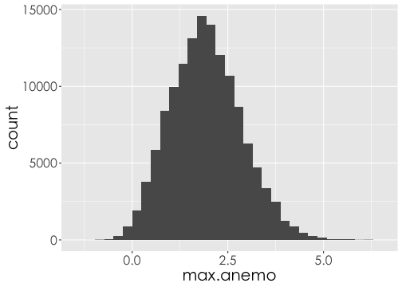

--- 
## Histogram
- `aes(y=..count..)` vs. `aes(y=..density..)`

```r
ggplot(ubike) +
  geom_histogram(aes(x=max.anemo, y=..density..)) + thm()
```

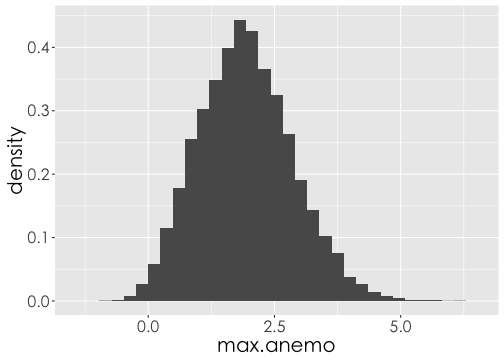

--- 

## Histogram
- `aes(x=..., y=..., fill=...)`

```r
ggplot(ubike) +
  geom_histogram(aes(x=max.anemo, y=..density.., fill=..count..)) + thm()
```


---

## Histogram + Density
- `geom_histogram() + geom_density()`

```r
ggplot(ubike, aes(x=max.anemo)) +
  geom_histogram(aes(y=..density.., fill=..count..)) +
  geom_density() + thm()
```

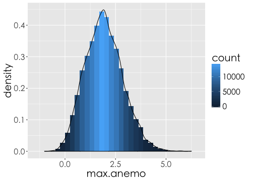

--- .dark .segue

## 量化 v.s. 量化：Scatter Plot

---

## 繪圖之前的整理資料
文山區各站點在"2015-02"的平均溼度 vs. 平均雨量


```r
x3 <- filter(ubike, grepl("2015-02", date, fixed = TRUE), sarea == "文山區") %>%
  group_by(sna) %>% 
  summarise(rain.avg = mean(rainfall), hum.avg = mean(humidity))
x3 # print(x3)
```

```
Source: local data frame [12 x 3]

                     sna  rain.avg  hum.avg
                  (fctr)     (dbl)    (dbl)
1           國立政治大學 0.9138340 86.78447
2  捷運動物園站(2號出口) 0.6944844 86.28648
3             捷運景美站 0.6752715 79.55976
4             捷運木柵站 0.6601309 85.49780
5                 考試院 0.9153789 80.25694
6         羅斯福景隆街口 0.6036172 80.38156
7       師範大學公館校區 0.7153086 80.71318
8       台北花木批發市場 0.6517227 80.96029
9       臺北市立景美女中 1.0727852 81.86252
10          文山行政中心 0.8457266 85.15373
11          文山運動中心 0.6683047 82.91816
12              興豐公園 0.6461699 81.34372
```

--- 

## Scatter plot
- `geom_point()`
- 參數`size`放在`aes()`函數外面，表示所有的資料固定用相同的size

```r
ggplot(x3) +
  geom_point(aes(x = rain.avg, y = hum.avg), size=5) + #size控制點的大小
  thm()
```

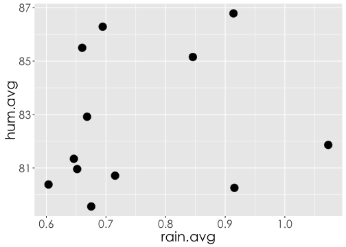

--- .largecontent
## Grouped scatter plot


```r
ggplot(x3) +
  # 放在aes裡的 colour 和 size 可依資料調整顏色和大小
  geom_point(aes(x = rain.avg, y = hum.avg, colour=sna, size=rain.avg)) +
  # 限制大小
  scale_size(range=c(5,10)) +  
  thm()
```

--- .largecontent
## Grouped scatter plot

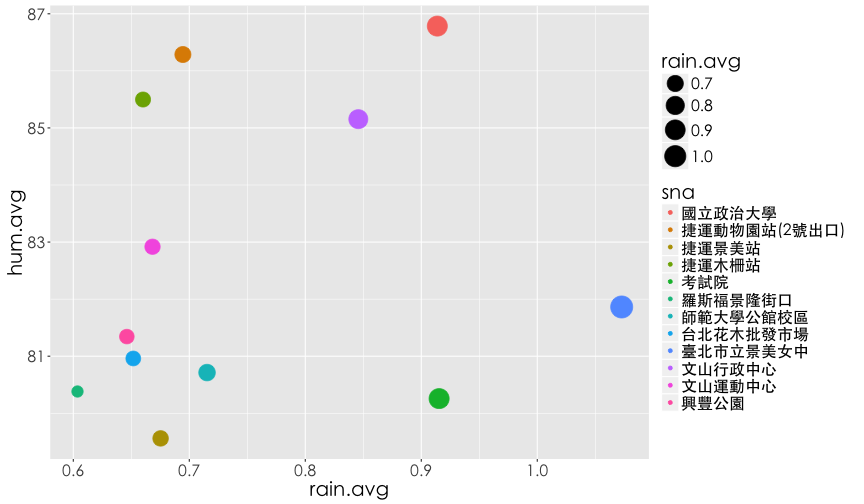

--- .dark .segue
## 量化 v.s. 量化：Line Chart

--- 
## WorldPhones

```r
data(WorldPhones)
WorldPhones
```

```
     N.Amer Europe Asia S.Amer Oceania Africa Mid.Amer
1951  45939  21574 2876   1815    1646     89      555
1956  60423  29990 4708   2568    2366   1411      733
1957  64721  32510 5230   2695    2526   1546      773
1958  68484  35218 6662   2845    2691   1663      836
1959  71799  37598 6856   3000    2868   1769      911
1960  76036  40341 8220   3145    3054   1905     1008
1961  79831  43173 9053   3338    3224   2005     1076
```

---
## 小挑戰
如何畫出每年亞洲電話數量的Line chart?

    ggplot(WorldPhones, aes(x=?????, y=Asia)) + ......

---

## 哪裏不對？

```r
ggplot(WorldPhones)
```

```
Error: ggplot2 doesn't know how to deal with data of class matrix
```

```r
class(WorldPhones)
```

```
[1] "matrix"
```

---
## `matrix` 轉換 `data.frame`

```r
WP.df <- as.data.frame(WorldPhones)
WP.df$year <- rownames(WP.df)
class(WP.df)
```

```
[1] "data.frame"
```

---
## Line chart
- `geom_line()`

```r
ggplot(WP.df, aes(x=year, y=Asia)) + geom_line()
```

```
geom_path: Each group consists of only one observation. Do you need to
adjust the group aesthetic?
```


---
## Should be Number
- `as.numeric()`

```r
str(WP.df)
```

```
'data.frame':	7 obs. of  8 variables:
 $ N.Amer  : num  45939 60423 64721 68484 71799 ...
 $ Europe  : num  21574 29990 32510 35218 37598 ...
 $ Asia    : num  2876 4708 5230 6662 6856 ...
 $ S.Amer  : num  1815 2568 2695 2845 3000 ...
 $ Oceania : num  1646 2366 2526 2691 2868 ...
 $ Africa  : num  89 1411 1546 1663 1769 ...
 $ Mid.Amer: num  555 733 773 836 911 ...
 $ year    : chr  "1951" "1956" "1957" "1958" ...
```

```r
WP.df$year <- as.numeric(WP.df$year)
```

---

## Line chart

```r
ggplot(WP.df, aes(x=year, y=Asia)) +
  geom_line() + thm()
```

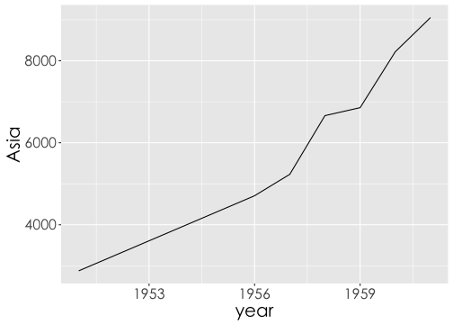

---
## Line chart and scatter plot

```r
ggplot(WP.df, aes(x=year, y=Asia)) +
  geom_line(size=2) + #size控制線的寬度或點的大小
  geom_point(size=5) + thm()
```

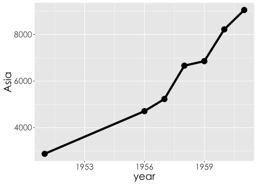

---

## How to plot multiple lines?

### Wide format
<!-- html table generated in R 3.2.2 by xtable 1.8-0 package -->
<!-- Thu Jan 14 02:29:25 2016 -->
<table border=1>
<tr> <th>  </th> <th> N.Amer </th> <th> Europe </th> <th> Asia </th> <th> S.Amer </th> <th> Oceania </th> <th> Africa </th> <th> Mid.Amer </th> <th> year </th>  </tr>
  <tr> <td align="right"> 1951 </td> <td align="right"> 45939.00 </td> <td align="right"> 21574.00 </td> <td align="right"> 2876.00 </td> <td align="right"> 1815.00 </td> <td align="right"> 1646.00 </td> <td align="right"> 89.00 </td> <td align="right"> 555.00 </td> <td align="right"> 1951.00 </td> </tr>
  <tr> <td align="right"> 1956 </td> <td align="right"> 60423.00 </td> <td align="right"> 29990.00 </td> <td align="right"> 4708.00 </td> <td align="right"> 2568.00 </td> <td align="right"> 2366.00 </td> <td align="right"> 1411.00 </td> <td align="right"> 733.00 </td> <td align="right"> 1956.00 </td> </tr>
  <tr> <td align="right"> 1957 </td> <td align="right"> 64721.00 </td> <td align="right"> 32510.00 </td> <td align="right"> 5230.00 </td> <td align="right"> 2695.00 </td> <td align="right"> 2526.00 </td> <td align="right"> 1546.00 </td> <td align="right"> 773.00 </td> <td align="right"> 1957.00 </td> </tr>
  <tr> <td align="right"> 1958 </td> <td align="right"> 68484.00 </td> <td align="right"> 35218.00 </td> <td align="right"> 6662.00 </td> <td align="right"> 2845.00 </td> <td align="right"> 2691.00 </td> <td align="right"> 1663.00 </td> <td align="right"> 836.00 </td> <td align="right"> 1958.00 </td> </tr>
  <tr> <td align="right"> 1959 </td> <td align="right"> 71799.00 </td> <td align="right"> 37598.00 </td> <td align="right"> 6856.00 </td> <td align="right"> 3000.00 </td> <td align="right"> 2868.00 </td> <td align="right"> 1769.00 </td> <td align="right"> 911.00 </td> <td align="right"> 1959.00 </td> </tr>
  <tr> <td align="right"> 1960 </td> <td align="right"> 76036.00 </td> <td align="right"> 40341.00 </td> <td align="right"> 8220.00 </td> <td align="right"> 3145.00 </td> <td align="right"> 3054.00 </td> <td align="right"> 1905.00 </td> <td align="right"> 1008.00 </td> <td align="right"> 1960.00 </td> </tr>
  <tr> <td align="right"> 1961 </td> <td align="right"> 79831.00 </td> <td align="right"> 43173.00 </td> <td align="right"> 9053.00 </td> <td align="right"> 3338.00 </td> <td align="right"> 3224.00 </td> <td align="right"> 2005.00 </td> <td align="right"> 1076.00 </td> <td align="right"> 1961.00 </td> </tr>
   </table>

$$\Downarrow$$

---
### Long format

```r
library(reshape2)
WP.long <- melt(WP.df, id='year') #id是將保留的欄位名稱
colnames(WP.long) <- c('year','area','number')
```
<!-- html table generated in R 3.2.2 by xtable 1.8-0 package -->
<!-- Thu Jan 14 02:29:25 2016 -->
<table border=1>
<tr> <th>  </th> <th> year </th> <th> area </th> <th> number </th>  </tr>
  <tr> <td align="right"> 1 </td> <td align="right"> 1951.00 </td> <td> N.Amer </td> <td align="right"> 45939.00 </td> </tr>
  <tr> <td align="right"> 2 </td> <td align="right"> 1956.00 </td> <td> N.Amer </td> <td align="right"> 60423.00 </td> </tr>
  <tr> <td align="right"> 3 </td> <td align="right"> 1957.00 </td> <td> N.Amer </td> <td align="right"> 64721.00 </td> </tr>
  <tr> <td align="right"> 4 </td> <td align="right"> 1958.00 </td> <td> N.Amer </td> <td align="right"> 68484.00 </td> </tr>
  <tr> <td align="right"> 5 </td> <td align="right"> 1959.00 </td> <td> N.Amer </td> <td align="right"> 71799.00 </td> </tr>
  <tr> <td align="right"> 6 </td> <td align="right"> 1960.00 </td> <td> N.Amer </td> <td align="right"> 76036.00 </td> </tr>
  <tr> <td align="right"> 7 </td> <td align="right"> 1961.00 </td> <td> N.Amer </td> <td align="right"> 79831.00 </td> </tr>
  <tr> <td align="right"> 8 </td> <td align="right"> 1951.00 </td> <td> Europe </td> <td align="right"> 21574.00 </td> </tr>
  <tr> <td align="right"> 9 </td> <td align="right"> 1956.00 </td> <td> Europe </td> <td align="right"> 29990.00 </td> </tr>
  <tr> <td align="right"> 10 </td> <td align="right"> 1957.00 </td> <td> Europe </td> <td align="right"> 32510.00 </td> </tr>
  <tr> <td align="right"> 11 </td> <td align="right"> 1958.00 </td> <td> Europe </td> <td align="right"> 35218.00 </td> </tr>
  <tr> <td align="right"> 12 </td> <td align="right"> 1959.00 </td> <td> Europe </td> <td align="right"> 37598.00 </td> </tr>
  <tr> <td align="right"> 13 </td> <td align="right"> 1960.00 </td> <td> Europe </td> <td align="right"> 40341.00 </td> </tr>
  <tr> <td align="right"> 14 </td> <td align="right"> 1961.00 </td> <td> Europe </td> <td align="right"> 43173.00 </td> </tr>
  <tr> <td align="right"> 15 </td> <td align="right"> 1951.00 </td> <td> Asia </td> <td align="right"> 2876.00 </td> </tr>
  <tr> <td align="right"> 16 </td> <td align="right"> 1956.00 </td> <td> Asia </td> <td align="right"> 4708.00 </td> </tr>
  <tr> <td align="right"> 17 </td> <td align="right"> 1957.00 </td> <td> Asia </td> <td align="right"> 5230.00 </td> </tr>
  <tr> <td align="right"> 18 </td> <td align="right"> 1958.00 </td> <td> Asia </td> <td align="right"> 6662.00 </td> </tr>
  <tr> <td align="right"> 19 </td> <td align="right"> 1959.00 </td> <td> Asia </td> <td align="right"> 6856.00 </td> </tr>
  <tr> <td align="right"> 20 </td> <td align="right"> 1960.00 </td> <td> Asia </td> <td align="right"> 8220.00 </td> </tr>
  <tr> <td align="right"> 21 </td> <td align="right"> 1961.00 </td> <td> Asia </td> <td align="right"> 9053.00 </td> </tr>
  <tr> <td align="right"> 22 </td> <td align="right"> 1951.00 </td> <td> S.Amer </td> <td align="right"> 1815.00 </td> </tr>
  <tr> <td align="right"> 23 </td> <td align="right"> 1956.00 </td> <td> S.Amer </td> <td align="right"> 2568.00 </td> </tr>
  <tr> <td align="right"> 24 </td> <td align="right"> 1957.00 </td> <td> S.Amer </td> <td align="right"> 2695.00 </td> </tr>
  <tr> <td align="right"> 25 </td> <td align="right"> 1958.00 </td> <td> S.Amer </td> <td align="right"> 2845.00 </td> </tr>
  <tr> <td align="right"> 26 </td> <td align="right"> 1959.00 </td> <td> S.Amer </td> <td align="right"> 3000.00 </td> </tr>
  <tr> <td align="right"> 27 </td> <td align="right"> 1960.00 </td> <td> S.Amer </td> <td align="right"> 3145.00 </td> </tr>
  <tr> <td align="right"> 28 </td> <td align="right"> 1961.00 </td> <td> S.Amer </td> <td align="right"> 3338.00 </td> </tr>
  <tr> <td align="right"> 29 </td> <td align="right"> 1951.00 </td> <td> Oceania </td> <td align="right"> 1646.00 </td> </tr>
  <tr> <td align="right"> 30 </td> <td align="right"> 1956.00 </td> <td> Oceania </td> <td align="right"> 2366.00 </td> </tr>
  <tr> <td align="right"> 31 </td> <td align="right"> 1957.00 </td> <td> Oceania </td> <td align="right"> 2526.00 </td> </tr>
  <tr> <td align="right"> 32 </td> <td align="right"> 1958.00 </td> <td> Oceania </td> <td align="right"> 2691.00 </td> </tr>
  <tr> <td align="right"> 33 </td> <td align="right"> 1959.00 </td> <td> Oceania </td> <td align="right"> 2868.00 </td> </tr>
  <tr> <td align="right"> 34 </td> <td align="right"> 1960.00 </td> <td> Oceania </td> <td align="right"> 3054.00 </td> </tr>
  <tr> <td align="right"> 35 </td> <td align="right"> 1961.00 </td> <td> Oceania </td> <td align="right"> 3224.00 </td> </tr>
  <tr> <td align="right"> 36 </td> <td align="right"> 1951.00 </td> <td> Africa </td> <td align="right"> 89.00 </td> </tr>
  <tr> <td align="right"> 37 </td> <td align="right"> 1956.00 </td> <td> Africa </td> <td align="right"> 1411.00 </td> </tr>
  <tr> <td align="right"> 38 </td> <td align="right"> 1957.00 </td> <td> Africa </td> <td align="right"> 1546.00 </td> </tr>
  <tr> <td align="right"> 39 </td> <td align="right"> 1958.00 </td> <td> Africa </td> <td align="right"> 1663.00 </td> </tr>
  <tr> <td align="right"> 40 </td> <td align="right"> 1959.00 </td> <td> Africa </td> <td align="right"> 1769.00 </td> </tr>
  <tr> <td align="right"> 41 </td> <td align="right"> 1960.00 </td> <td> Africa </td> <td align="right"> 1905.00 </td> </tr>
  <tr> <td align="right"> 42 </td> <td align="right"> 1961.00 </td> <td> Africa </td> <td align="right"> 2005.00 </td> </tr>
  <tr> <td align="right"> 43 </td> <td align="right"> 1951.00 </td> <td> Mid.Amer </td> <td align="right"> 555.00 </td> </tr>
  <tr> <td align="right"> 44 </td> <td align="right"> 1956.00 </td> <td> Mid.Amer </td> <td align="right"> 733.00 </td> </tr>
  <tr> <td align="right"> 45 </td> <td align="right"> 1957.00 </td> <td> Mid.Amer </td> <td align="right"> 773.00 </td> </tr>
  <tr> <td align="right"> 46 </td> <td align="right"> 1958.00 </td> <td> Mid.Amer </td> <td align="right"> 836.00 </td> </tr>
  <tr> <td align="right"> 47 </td> <td align="right"> 1959.00 </td> <td> Mid.Amer </td> <td align="right"> 911.00 </td> </tr>
  <tr> <td align="right"> 48 </td> <td align="right"> 1960.00 </td> <td> Mid.Amer </td> <td align="right"> 1008.00 </td> </tr>
  <tr> <td align="right"> 49 </td> <td align="right"> 1961.00 </td> <td> Mid.Amer </td> <td align="right"> 1076.00 </td> </tr>
   </table>

---
## Multiple Line

```r
ggplot(WP.long,aes(x=year, y=number, group=area, color=area)) + # gruop按照不同區域劃線
  geom_line(size=1.5) + geom_point(size=5) + thm()
```

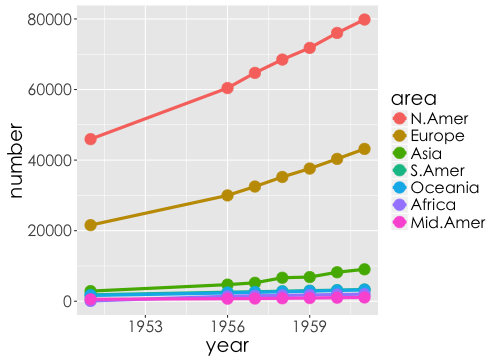


--- .dark .segue
## 質化 v.s. 量化：Bar Chart

---
## 讀取檔案
[痞客邦 Visitor Log 訓練資料集 (train.csv)](http://goo.gl/mwtvMj)


```r
pixnet <- read.csv('train.csv', stringsAsFactors = FALSE)
```

- 2014-11-01 至 2014-11-30 期間，10000 筆隨機取樣的台灣地區網站訪客的瀏覽紀錄

--- 
## 欄位說明
- url_hash - 去識別後的部落格文章 url
- resolution - 瀏覽裝置的螢幕解析度
- browser - 瀏覽裝置的瀏覽器
- os - 瀏覽裝置的作業系統
- device_marketing - 瀏覽裝置的產品型號
- device_brand - 瀏覽裝置的品牌名稱
- cookie_pta - 去識別化的瀏覽者代碼
- date - 瀏覽日期
- author_id - 文章作者 ID 去識別碼
- category_id - 文章分類
- referrer_venue - 訪客來源（網域）

--- 
## Bar chart - `geom_bar()`

```r
ggplot(pixnet, aes(x=referrer_venue)) + geom_bar() + 
  theme(axis.text.x = element_text(angle = 90, hjust = 1)) +
  thm()
```

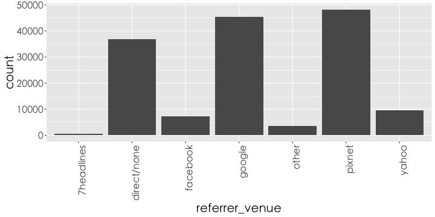

--- 
## Bar chart
- 長條圖排序

```r
library(dplyr)
level <- table(pixnet$referrer_venue) %>% names
rank <- table(pixnet$referrer_venue) %>% order(decreasing = TRUE)
level
```

```
[1] "7headlines"  "direct/none" "facebook"    "google"      "other"      
[6] "pixnet"      "yahoo"      
```

```r
level[rank]
```

```
[1] "pixnet"      "google"      "direct/none" "yahoo"       "facebook"   
[6] "other"       "7headlines" 
```

```r
pixnet$referrer_venue <- factor(pixnet$referrer_venue, levels = level[rank])
```

---
## Bar chart
- 長條圖排序

```r
ggplot(pixnet, aes(x=referrer_venue)) + geom_bar() + 
  theme(axis.text.x = element_text(angle = 90, hjust = 1)) +
  thm()
```

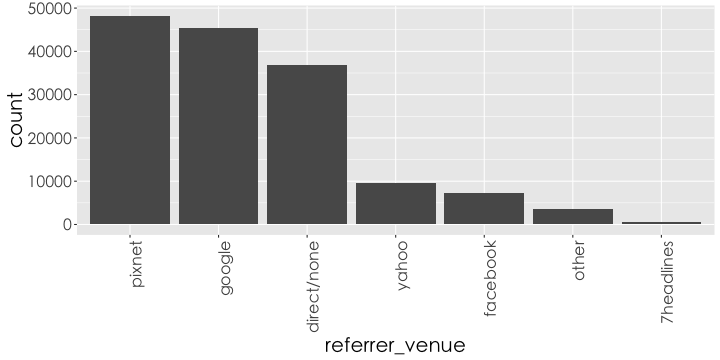


---
## 兩種類別


```r
ub2 <- filter(ubike, sarea=='中和區',hour==8) %>% 
  mutate(is.rain=rainfall>1) %>%
  mutate(is.rain=factor(is.rain, levels=c(FALSE, TRUE), 
                        labels = c("晴天","雨天"))) %>%
  select(date,avg.bemp, sna, is.rain, tot) %>%
  group_by(sna, is.rain) %>%
  summarise(use_rate=mean(avg.bemp/tot)) 
head(ub2)
```

```
Source: local data frame [6 x 3]
Groups: sna [3]

             sna is.rain  use_rate
          (fctr)  (fctr)     (dbl)
1 捷運永安市場站    晴天 0.7410044
2 捷運永安市場站    雨天 0.7827569
3       秀山國小    晴天 0.5095047
4       秀山國小    雨天 0.3444234
5       中和公園    晴天 0.6878744
6       中和公園    雨天 0.6147391
```

---
## 兩種類別


```r
ggplot(ub2, aes(x=sna, y=use_rate, fill=is.rain)) +
  geom_bar(stat='identity') + # stat='identity'以表格的值做為bar的高度
  theme(axis.text.x = element_text(angle = 90, hjust = 1)) + #控制字的方向
  thm()
```

---
## 兩種類別: stack

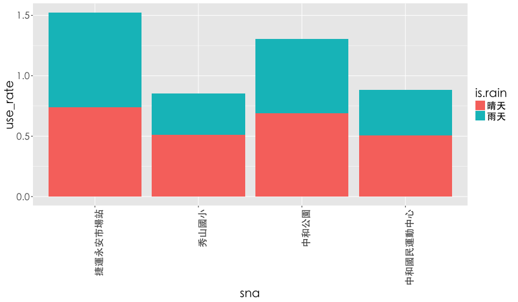

---
## 兩種類別: dodge


```r
ggplot(ub2,aes(x=sna, y=use_rate, fill=is.rain)) +
  geom_bar(stat='identity',position = 'dodge') + #dodge類別並排
  theme(axis.text.x = element_text(angle = 90, hjust = 1)) + #控制字的方向
  thm()
```

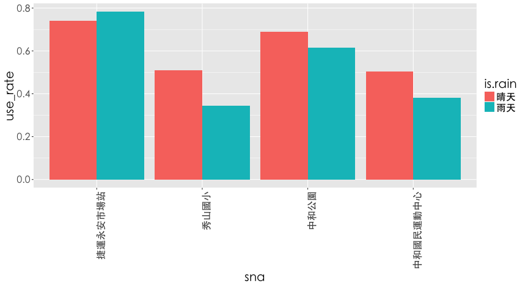

---
## Pie Chart: Bar chart變形
### 整理資料

```r
pix <- data.frame(table(pixnet$referrer_venue)) #table可以算個類別個數
colnames(pix) <- c('referrer','count')
pix[5,2] <- pix[5,2] + pix[1,2]
pix <- pix[-1,]
```

---
## Pie Chart: Bar Chart變形
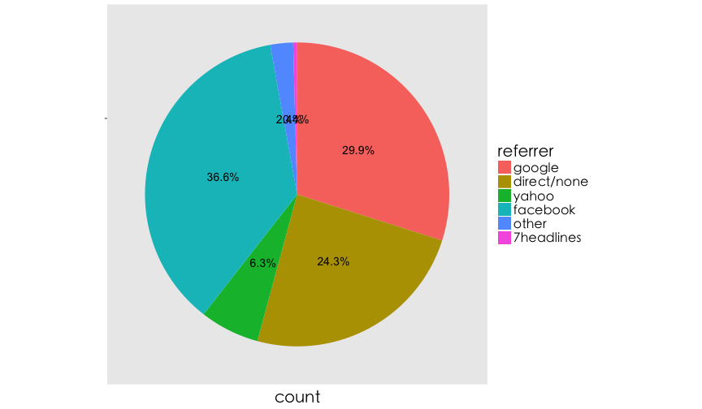 

---
## Pie Chart: Bar Chart變形

```r
ggplot(pix,aes(x="", y=count, fill=referrer))+
  geom_bar(stat='identity', width=1)+
  coord_polar('y')+
  geom_text(aes(y = count*0.5+ c(0, cumsum(count)[-length(count)]), 
                label = paste(round(count/sum(count),3)*100,'%',sep="")),
            size=5)+
  theme(axis.title.y=element_blank(),
        axis.text.x=element_blank(),
        panel.grid=element_blank()) + thm()
```


---
## Pie Chart: Bar Chart變形
### 整理資料

```r
pix <- arrange(pix, -count)

ggplot(pix,aes(x="", y=count, fill=referrer)) +
  geom_bar(stat='identity',width=1) +
  coord_polar('y') +
  geom_text(aes(y = count*0.5 + c(0, cumsum(count)[-length(count)]), 
                label = paste(round(count/sum(count),3)*100,'%',sep="")),
            size=5) +
  theme(axis.title.y = element_blank(),
        axis.text.x=element_blank(),
        panel.grid=element_blank()) + thm()
```

---
## Pie Chart: Bar Chart變形
### 整理資料


--- .dark .segue
## 快速重播 + 進階繪圖

--- .largecontent
## ggplot2基本架構

- 資料 (data) 和映射 (mapping)
- 幾何對象 (`geom`etric)
- 座標尺度 (`scale`)
- 統計轉換 (`stat`istics)
- 座標系統 (`coord`inante)
- 圖層 (layer)
- 刻面 (`facet`)
- 主題 (`theme`)

--- 
## Data and Mapping
- data : `ggplot(data=..)`
- mapping : `aes(x=..., y=...)`

```r
ggplot(data=WP.df) + geom_line(aes(x=year, y=Asia))
```

---
## `geom`etric
- `geom_line`, `geom_point`, ...

```r
ggplot(WP.df, aes(x=year,y=Asia)) +
  geom_line(size=2) + geom_point(size=5)
```

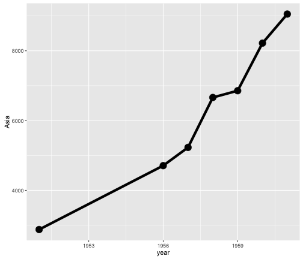

--- 
## `scale`
- `size`, `scale_size`, `scale_xxx_xxx`, ...

```r
ggplot(x3) +
  geom_point(aes(x = rain.avg, y = hum.avg), size=5) + #size控制點的大小
  thm()
```

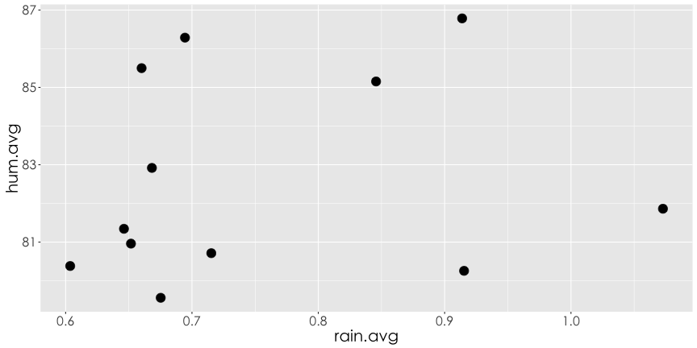

--- 
## `stat`istics


```r
 ggplot(pressure,aes(x=temperature, y=pressure)) +
  geom_point() + stat_smooth()
```

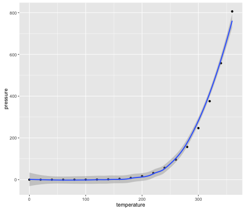

--- &twocol
## `coord`inante 

*** =left


```r
ggplot(pix,aes(x="", y=count, fill=referrer)) +
  geom_bar(stat='identity') + thm()
```

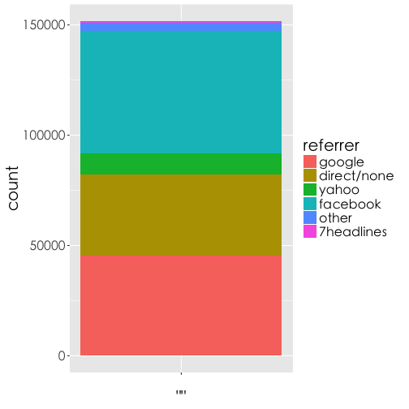 

*** =right


```r
ggplot(pix,aes(x="", y=count, fill=referrer)) +
  geom_bar(stat='identity', width=1) +
  coord_polar('y') + thm()
```

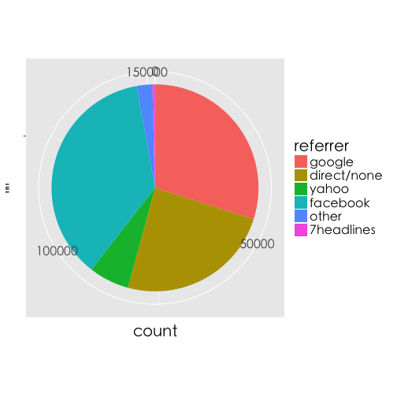 


--- .largecontent
## `facet`
- 資料整理，`中和區``各場站``每日平均雨量`

```r
rain <- filter(ubike, grepl("2015-02", date, fixed = TRUE), sarea == "中和區") %>%
  group_by(date, sna) %>% 
  summarise(avg.rain = mean(rainfall))
```

---
## `facet`
- Line Chart

```r
ggplot(rain) + 
  geom_line(aes(x=date, y=avg.rain, group=sna, colour=sna), size=2) +
  theme(axis.text.x = element_text(angle = 90, hjust = 1)) + #控制字的方向
  thm()
```

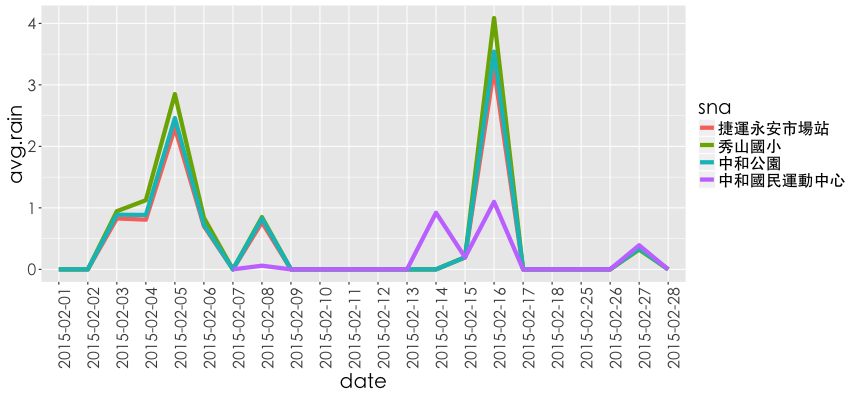

--- .largecontent
## Line Chart in Facets


```r
ggplot(rain) + 
  geom_line(aes(x=date, y=avg.rain, group=sna, colour=sna),size=2) +
  theme(axis.text.x = element_text(angle = 90, hjust = 1)) + #控制字的方向
  thm() +
  facet_wrap(~sna, nrow=2) # facet_wrap將各站的情況分開畫
```

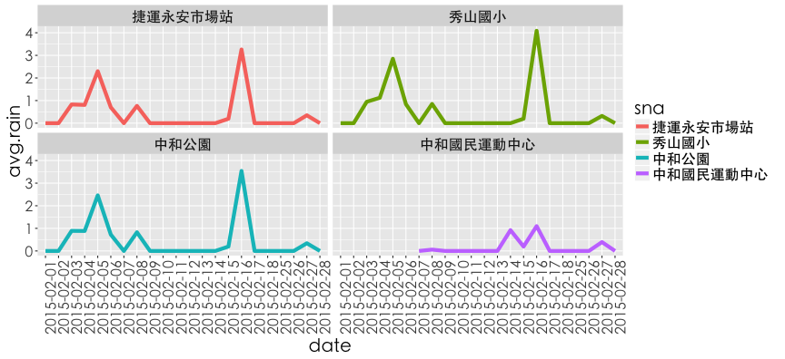

--- .dark .segue
## 圖形輸出

--- .largecontent
## 圖形輸出
- 利用RStudio UI介面存擋
- 命立列輸出

    # 畫完圖之後，再存檔~~
    ggsave('檔案名稱')
    ggsave("mtcars.pdf", width = 4, height = 4)
    ggsave("mtcars.png", width = 4, height = 4, dpi = 300)


--- .dark .segue
## 學習資源

--- .largecontent
- [ggplot2 cheat sheet from RStudio Inc.](http://www.rstudio.com/wp-content/uploads/2015/03/ggplot2-cheatsheet.pdf)
- [ggplot2 官方文件](http://docs.ggplot2.org/current/index.html)


---  .largecontent
## 掌握心法後，如何自行利用R 解決問題

- 了解自己的需求
- 詢問關鍵字與函數
    - 歡迎來信 <benjamin0901@gmail.com>, <johnson@dsp.im>或其他教師
    - 多多交流
        - [Taiwan R User Group](http://www.meetup.com/Taiwan-R)，mailing list: <Taiwan-useR-Group-list@meetup.com>
        - ptt R_Language版
        - [R軟體使用者論壇](https://groups.google.com/forum/#!forum/taiwanruser)


--- .dark .segue

## Team Project
